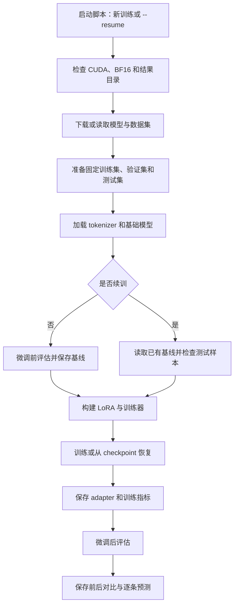

# Gemma 4 CUDA LoRA 训练流程

对应脚本：[cuda_254_gemma4.py](cuda_254_gemma4.py)。

```mermaid
flowchart TD
    A[启动脚本：新训练或 --resume] --> B[检查 CUDA、BF16 和结果目录]
    B --> C[下载或读取模型与数据集]
    C --> D[准备固定训练集、验证集和测试集]
    D --> E[加载 tokenizer 和基础模型]
    E --> F{是否续训}
    F -->|否| G[微调前评估并保存基线]
    F -->|是| H[读取已有基线并检查测试样本]
    G --> I[构建 LoRA 与训练器]
    H --> I
    I --> J[训练或从 checkpoint 恢复]
    J --> K[保存 adapter 和训练指标]
    K --> L[微调后评估]
    L --> M[保存前后对比与逐条预测]
```

结果默认保存在 `/root/tmp/result`，该目录位于临时空间；需要留存的产物应在实例结束前备份。
